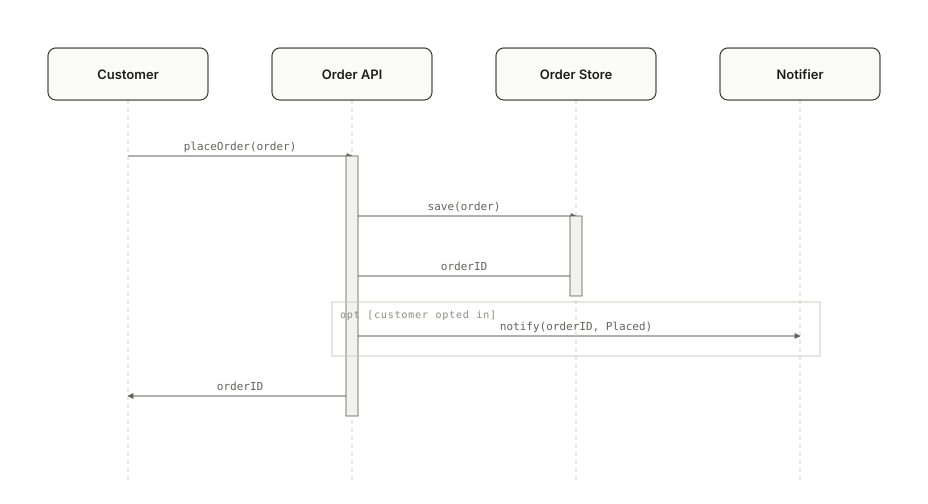
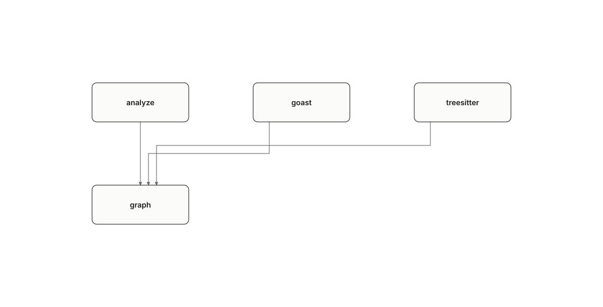

# diagrammer

[](https://github.com/0xmhha/diagrammer/tags)
[](LICENSE)
[](go.mod)
[](docs/install.md)

**Reads a source tree and draws UML diagrams of it: component, sequence, state
and use case, as a self-contained HTML page, as Mermaid, or as SVG.**



The analysis is done by a program and is deterministic. The *meaning*, which
things are the parts, what to call them and how to nest them, is decided by a
model of your choosing in a step this program hands out and takes back, and
everything the model says is checked against the code before anything is drawn.
Every relationship the code proves is either on the page or recorded on it with
the reason it could not be drawn. Nothing goes missing in silence.

## Contents

- [Who this is for](#who-this-is-for)
- [What you get](#what-you-get)
- [Install](#install)
- [Quick start](#quick-start)
- [Commands](#commands)
- [Output formats](#output-formats)
- [Using it from an MCP client](#using-it-from-an-mcp-client)
- [How it works](#how-it-works)
- [Languages and builds](#languages-and-builds)
- [Limits, stated plainly](#limits-stated-plainly)
- [Building from source](#building-from-source)
- [Contributing](#contributing)
- [Documents](#documents)
- [Acknowledgements](#acknowledgements)
- [License](#license)

## Who this is for

- **Someone opening a codebase they do not know**, who wants a map before the
  census: what the parts are, which way they lean, and a page to click into.
- **Someone writing about a codebase**, a README, a design note or a slide, who
  wants a diagram that was checked against the code rather than drawn from
  memory, in a shape that embeds where they are writing.
- **Someone building a plugin or an agent** that needs diagrams of a repository
  and wants a local tool with a small, checkable contract rather than a service.

## What you get

- **Four UML families**, with the vocabulary that makes them UML: components
  with provided and required interfaces and ports; sequences with lifelines,
  activations and combined fragments; states with `trigger [guard] / effect`
  transitions; use cases with actors, a system boundary, include and extend.
- **Levels you can click into.** A large model is split into an overview and
  the pages beneath it, and a box that opens a page says so.
- **Honest pages.** A relationship the layout cannot route is recorded on the
  page beside the drawing, with the rule that refused it. `drawn + dropped ==
  proven` holds on every page.
- **A drawing that names its commit**, read from `.git` without running git,
  so a reader knows which version of the code they are looking at.
- **Coverage you can check.** A model says which parts of the code each
  component stands for, and the program does the arithmetic:
  `coverage: 15659 of 15659 nodes (100%), every area accounted for`.
- **Three ways out**: an HTML page with hover highlighting and drill-down; a
  Markdown file of Mermaid blocks for GitHub, Notion or Obsidian; standalone
  SVG files framed for a slide, a document or a print.
- **Two surfaces, one contract.** Every capability is a subcommand and an MCP
  tool, built from one registry, and tests hold the two to the same set.
- **Deterministic.** The same input produces the same bytes, and the release
  gate checks it.

## Install

Requirements: macOS 12 or later. A Go toolchain (1.25 or later) to build from
source; none to run a packaged build.

**From source**, onto `PATH` through `GOBIN`:

```sh
go install github.com/0xmhha/diagrammer/cmd/diagrammer@latest
```

**From a working copy:**

```sh
git clone https://github.com/0xmhha/diagrammer.git
cd diagrammer
make build          # bin/diagrammer
make install        # or onto PATH
```

**A packaged build** for a mac that cannot build it: `make dist` produces an
archive per architecture with both binaries, the licences and
[docs/install.md](docs/install.md), which says what macOS does to a download
and the one command that fixes it.

Optional, for the one-command path: a model command line such as Claude Code
(`claude -p`). Nothing else calls a model, and nothing needs a network.

## Quick start

From a working copy, one command draws a project:

```sh
make diagram SRC=../some/project AI=1
```

That reads the tree, has a model write the UML, checks what it wrote against the
code, and draws every family it declared:

```
out/diagram/
  graph.json                 what the code proves
  model.codegraph.json       what the model said it means
  component.html             the page, with levels to click into
  component.md               the same, as Mermaid
  svg/component/*.svg        the same, one file per level
  sequence.html  state.html  usecase.html   and so on
```

`AI=1` is opt-in and always will be: it spends money and hands the graph, which
carries every doc comment in the tree, to whoever runs that model. Without it
the command stops after stage 1 and says exactly which two files to hand to a
model and what to run next. With `MODEL=path.codegraph.json` it draws from a
model you already have.

The same thing by hand, one stage at a time:

```sh
diagrammer graph    ./src -o graph.json                 # 1. what the code proves
diagrammer instruct -o stage-2.md                       # 2. what to ask a model
#    ... a model reads graph.json and stage-2.md, returns model.codegraph.json ...
diagrammer validate model.codegraph.json -graph graph.json
diagrammer compose  model.codegraph.json -o out         # 3. lay out, per family
diagrammer render   out/component.diagram.json -o component.html   # 4. draw
```

## Commands

| Command | What it does |
|---|---|
| `graph <dir> [-o file]` | Parse a source tree into a code graph. `-exclude dir,dir`, `-max-depth n`, `-tests` to read test files. |
| `instruct [-o file]` | Print the instruction stage 2 is performed from, built from the embedded schemas. |
| `validate <model> [-graph file]` | Accept or refuse a UML model, naming every defect. With `-graph`, report how much of the code it accounts for. |
| `compose <model> -o <dir> [-family f]` | Turn a model into one diagram source per family it declares. |
| `render <doc> -o <file> [-level id]` | Draw a diagram source as a self-contained HTML page. `-level` draws one level alone. |
| `mermaid <doc> -o <file>` | Write a diagram source as Markdown with one Mermaid block per level. |
| `svg <doc> -o <dir> [-level id] [-size preset]` | Write one standalone SVG per level, framed to a size. |
| `serve [-root dir]` | Offer every capability above as a local MCP server over stdio. |
| `version` | Print the version and build details. |

Every command reads a file you name and writes where you say. Nothing reaches
for a network. An exit code of 0 means the artefact you asked for was produced,
and anything it could not use is said on stderr; 1 means it was not produced,
and the message names the input at fault.

## Output formats

### The page

`render` writes one HTML file that opens from disk with no server: the drawing,
an embedded viewer that moves between levels, hover highlighting that fades
everything a box is not joined to, and the record of what could not be drawn.
The commit the drawing was made from is in the header. The page is drawn to a
handful of editorial rules, hairlines, one accent and only under the pointer,
three font roles, no shadows, every coordinate on a four-pixel grid, and each
rule is held by a test.



### Mermaid

`mermaid` writes one Markdown file with a fenced block per level, which GitHub,
Notion and Obsidian render as they are. It is not bound by a grid, so it carries
every relationship the document proved, including any the page had to record,
and marks them. A use case diagram has no Mermaid grammar of its own and is
written as a flowchart; the file says so.

### SVG

`svg` writes one file per level with its styles resolved, so nothing needs a
page around it, and its title and description carried for a screen reader.
`-size` frames it: `fit` (the default, the drawing's own size), `doc-inline`,
`doc-wide`, `slide-16x9`, `slide-4x3`, `social-og`, `social-square`,
`print-a4-landscape`, `print-letter-landscape`. A frame smaller than the drawing
scales it down, which the page never does, and the command says how far and
what the smallest label came to.

PNG is not produced. Rasterising needs a renderer this program does not carry.

## Using it from an MCP client

`serve` speaks MCP over stdio: `diagrammer serve` starts it. Point a client at the binary:

```json
{ "command": "/path/to/diagrammer", "args": ["serve", "-root", "/path/to/work"] }
```

Three things the client learns before it does any work:

- **The server's instructions**, at `initialize`: what the four stages are,
  which order they go in, and that the caller performs stage 2 itself.
- **The `stage-2` prompt**: the instruction that stage is performed from.
- **The three schemas as resources**, each under its own `$id`.

**Every path argument is confined to one directory**, the one the server was
started in unless `-root` says otherwise. A path outside it is refused with the
root named. Stage 1 hands a model the doc comments of a repository it did not
write, and the next tool call takes a path to overwrite; the distance between
those two is worth closing. `-root /` is how you say you meant everywhere.

## How it works

Four stages, each a command, and one of them not in this program:

1. **`graph`** parses the source with an AST parser and emits a code graph:
   packages, files, types and functions, the imports and calls it can prove,
   the doc comments their authors wrote, and the commit the tree was at.
   Nothing is interpreted here.
2. **A model**, yours, via a plugin, a skill or `make diagram AI=1`, reads
   that graph and returns a UML model. `instruct` is what it works from, built
   from the same embedded schemas the gate uses, so what a model is told and
   what its answer is checked against cannot disagree. The model also says
   which graph nodes each component stands for, which is the one claim in it
   that can be checked rather than believed.
3. **`compose`** turns the model into one diagram source per family: boxes in
   cells, connections between them, levels to open. Laid out, not yet drawn.
4. **`render`**, **`mermaid`** and **`svg`** draw that source.

`validate` is the only gate between stages 2 and 3. Three JSON Schema files
define the boundaries and are embedded in the binary; Go types are checked
against them by a test, not the other way round, because stage 2 runs outside
this program and has to be readable without Go.

Why a model is not inside the binary: asked the same question twice, a model
answers differently. The stages this program owns are deterministic and the
release gate checks that; a model would end that. So a model's answer is
treated as source, written once, read, kept, and everything after it is
reproducible. [docs/decisions.md](docs/decisions.md) has the reasoning for
this and for every other structural choice.

## Languages and builds

One source tree, two builds. Which one you have is printed every time `graph`
runs, so nobody discovers the scope by pointing it at a repository and wondering
why the graph came back nearly empty.

| Build | Reads | Needs |
|---|---|---|
| `make build`, `diagrammer` | Go, with `go/ast` from the standard library. **Reads Go and nothing else.** | Go and make. This is what the release gate covers. |
| `make build-polyglot`, `diagrammer-polyglot` | Go, plus Python, Solidity and JS/TS through tree-sitter. | A C compiler, because tree-sitter is C. |

`go/ast` refuses a file it cannot parse. tree-sitter does not, so every tree is
asked whether it parsed cleanly, and a file that did not is reported with its
line and with how much of it still reached the graph. Adding a language is
described in [docs/analyzer-interface.md](docs/analyzer-interface.md).

## Limits, stated plainly

- **macOS only, today.** Both mac architectures are built, packaged and run.
  `make linux` refuses, because nothing here can run a Linux binary and the
  rule is that nothing ships until it has been run.
- **Stage 2 is a model, and a model is not a function.** Two runs over one
  graph give two models that agree on shape and differ in names and scope. Keep
  the model you like; everything downstream of it is byte-identical.
- **The AI path spends money and sends code comments to a model.** It is
  opt-in and will not become a default.
- **Very large graphs are read, not sent.** A graph too big for a prompt is
  read by the model with its own tools; a 9.2 MB graph of 15,660 nodes draws in
  about four minutes that way. `validate -graph` says whether it read all of it.
- **No PNG.** SVG and HTML only.
- **Packaged binaries are ad-hoc signed, not notarised.** macOS will refuse a
  quarantined download until one `xattr` command; `docs/install.md` has it.

## Building from source

```
make build           # bin/diagrammer, reading Go
make build-polyglot  # bin/diagrammer-polyglot, reading four languages
make check           # fmt, vet, lint, test: before a commit
make verify          # the release gate: fmt-check, vet, test, fixtures
make verify-cgo      # the second gate, for the four-language build
make dist            # archives for a mac that cannot build it
make diagram         # draw a project; see Quick start
make screenshots     # regenerate the drawings this file shows
make help            # every target
```

`make verify` runs offline on a clean machine with nothing but Go and make
installed. Anything it needs that such a machine lacks is a defect, not a
prerequisite. It renders every committed fixture twice and requires the bytes to
match.

```
cmd/diagrammer/      the command line and the MCP server, one registry
internal/analyze/    stage 1: go/ast and tree-sitter analyzers
internal/schema/     the three schemas, embedded, and the drift guard
internal/validate/   the stage-2 gate, and coverage against the graph
internal/compose/    stage 3: layout into cells and levels
internal/render/     stage 4: routing, the page, SVG files
internal/mermaid/    stage 4: Mermaid text
internal/invariant/  the composition rules, checked on the emitted artefact
testdata/            fixtures: source trees and stage-2 models
docs/                the contract, the thresholds, the decisions
```

## Contributing

Issues and pull requests are welcome.

- Run `make check` before a commit and `make verify` before a pull request.
  Both builds have to pass: `make verify-cgo` covers the second.
- Every rule has a fixture that breaks it. A change to a threshold starts with
  a measurement, and [docs/thresholds.md](docs/thresholds.md) is where the
  number and its measurement live together.
- The schemas are the contract. Change a schema and the Go type follows, not
  the other way round; a test holds them together.
- Commit messages follow Conventional Commits: `type(scope): summary`, in
  English, essentials first.
- Anything brought in from elsewhere is recorded in
  [THIRD_PARTY_NOTICES.md](THIRD_PARTY_NOTICES.md) in the same commit, with its
  licence. [docs/licensing.md](docs/licensing.md) says what needs a row and
  what does not.

If you think you have found a security problem, and the MCP root confinement is
the boundary that matters, please open an issue and say so in the title, and
prefer describing the class of problem over a working exploit.

## Documents

- [docs/invariants.md](docs/invariants.md): the correctness contract, what
  every stage must prove, and what each family means by completeness.
- [docs/thresholds.md](docs/thresholds.md): every number that decides what a
  page shows, and where it came from.
- [docs/analyzer-interface.md](docs/analyzer-interface.md): how a language
  gets read, and what adding one costs.
- [docs/decisions.md](docs/decisions.md): what the design settled on, what was
  withdrawn, and what is still open. Read this before changing anything
  structural.
- [docs/install.md](docs/install.md): for the recipient of a packaged build.
- [docs/licensing.md](docs/licensing.md): what may be borrowed and what must
  be attributed.

## Acknowledgements

diagrammer is a separate program written in Go. It is not a fork or a port of
anything, and it is not endorsed by or affiliated with the projects below. It
does owe them ideas, and says so.

- **[Archify](https://github.com/tt-a1i/archify)** (MIT), a Node.js project
  where the four-stage shape, the composition rules, the level-splitting and the
  idea of recording every relationship a drawing could not hold were first
  built. The behaviour was learned there and written here from scratch; no
  file of Archify's is in this repository.
- **[diagram-design](https://github.com/cathrynlavery/diagram-design)** (MIT),
  an editorial design system for diagrams, from which the page's rules,
  hairlines, one accent, three font roles, the four-pixel grid, and the names
  and dimensions of the SVG frame presets were taken. No HTML, CSS, script or
  reference text of it is in this repository, and its web fonts are not used,
  because a page here opens offline.

What each of these permits and requires is written down in
[docs/licensing.md](docs/licensing.md), and what was actually taken is recorded
in [THIRD_PARTY_NOTICES.md](THIRD_PARTY_NOTICES.md) with the notices that
travel with it. Every Go module compiled into the binary is listed there too,
with its version and licence.

## License

MIT. Copyright (c) 2026 mhha. See [LICENSE](LICENSE).

Third-party material and the notices that accompany it are in
[THIRD_PARTY_NOTICES.md](THIRD_PARTY_NOTICES.md).
